# Project overview

for this "Object detection in an urban environment" project, we have performed exploratory data analysis. then we splitted the dataset into three parts training, testing and validation. In our case, we kept 75 data for the training and 15 for testing and validation. 

After editing the config file, we monitored the training and testing performance by using tensorboard. Then we tuned some hyperparameters in the config file to differentiate the performance with the previous training and evaluation process.

I have added several screenshots of my performance charts and detecting objects from our data. I have also added a video file to this repository.

All the files associated with this project can be found in this github repository https://github.com/hamzazia0/Object-Detection-in-an-Urban-Environment .

# Dataset

We used portion of the data from the Waymo Open dataset for this project. we downloaded the data using 'download_process.py' file. Kindly checkout the readme file to see the more detailed instruction.

## Dataset Analysis

In order to complete this step, we worked on the "Exploratory Data Analysis" notebook. We implemented the "display_instances" function to run the file.

After successfully executing the file, we can checkout some images where objects were succesfully detected by the program.
    

    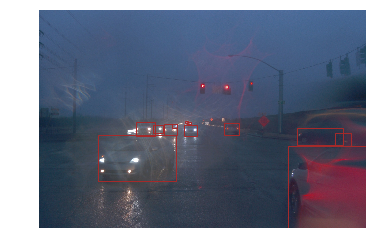
     
    <em>EDA_1</em>

    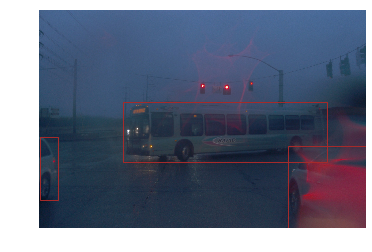
     
    <em>EDA_2</em>

    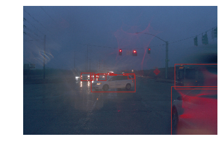
     
    <em>EDA_3</em>

## Cross Validation

At first, we fixed the "split" function in the "create_split.py" file to split the dataset. Then we ran the following script  "python create_splits.py --data_dir /home/workspace/data/"

After successfully executing the command, the dataset was splitted into three parts, training, testing and validation. We allocated 70 data for training, 15 each for testing and validation.

After that, we shuffled the dataset to make sure that images containing various objects are randomly distributed among training, testing and validation section.

# Training

We followed the steps below to train and evaluate the model.

1. At first, we need to create a new config file "pipeline_new.config" by using the following command "python edit_config.py --train_dir /home/workspace/data/train/ --eval_dir /home/workspace/data/val/ --batch_size 8 --checkpoint ./training/pretrained-models/ssd_resnet50_v1_fpn_640x640_coco17_tpu-8/checkpoint/ckpt-0 --label_map label_map.pbtxt". Then, we prepared a sub-folder name 'reference' inside the training folder where we are keeping the new config file. With the help of new config file, we trained and evaluated the model.

2. To train the model, run "python experiments/model_main_tf2.py --model_dir=training/reference/ --pipeline_config_path=training/reference/pipeline_new.config" in the terminal.   

3. To evaluate the model while it's being trained, run "CUDA_VISIBLE_DEVICES=""  python  ./experiments/model_main_tf2.py --model_dir=training/reference/ --pipeline_config_path=training/reference/pipeline_new.config --checkpoint_dir=training/reference/"   

4. To monitor the training progress, run "tensorboard --logdir=training/reference"   

## Reference Experiment

With the help of tensorboard, we monitored our training and evaluation process. The screenshots are provided below:

1. Precision chart:

    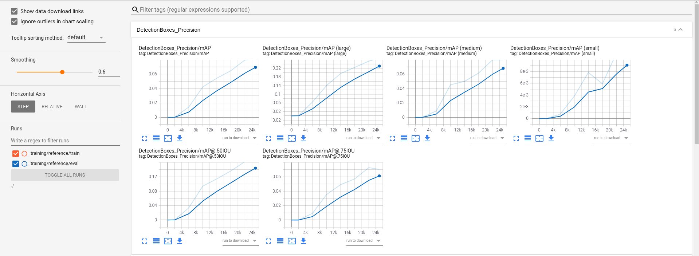
     
    <em>Precision chart</em>

2. Recall chart:

    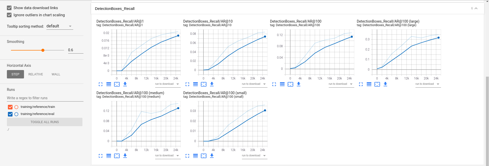
     
    <em>Recall chart</em>

3. Loss chart:

    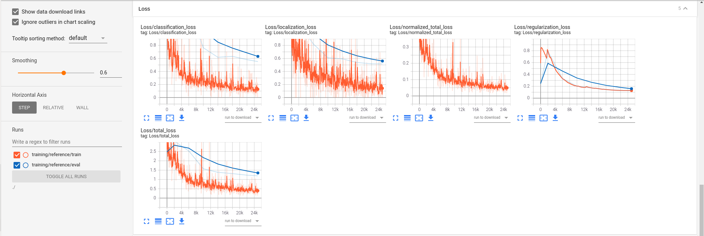
     
    <em>Loss chart</em>

4. Learning rate chart: 

The learning rate approach was to get a warm up value of around 0.015 and then slowly increasing it up to 0.04 in the first 2000 steps. Then to finally decrease it very slowly upto the 8000 steps. Here's the screenshot

    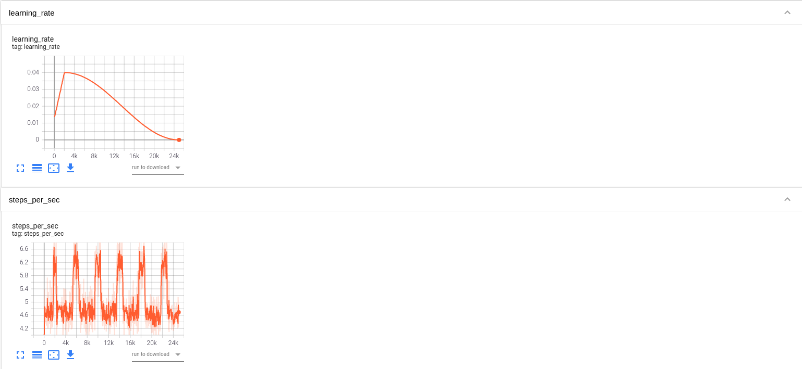
     
    <em>Learning rate and steps per second</em>

## Improve on the performances

We have implemented the below augmentation from the "preprocessor.proto" file to improve the performance.

- random_adjust_brightness: 
    There are some images which is not clear or taken in the dark. By adjusting the brightness it would be possible to detect objects more properly.

- random_rgb_to_gray:
    Sometimes being in the bright area or area which are foggy, made models difficult to detect objects. By using the rgb_to_gray augmentation, we are increasing our detection rate.

- random_image_scale:
    By using this augmentation, we can scale our image to remove unwanted or unnecessary things from the image or to detect things properly.

- random_jpeg_quality:
    This augmentation will adjust our image quality.

After implementing these changes here are the result we got:

1. Precision chart:

    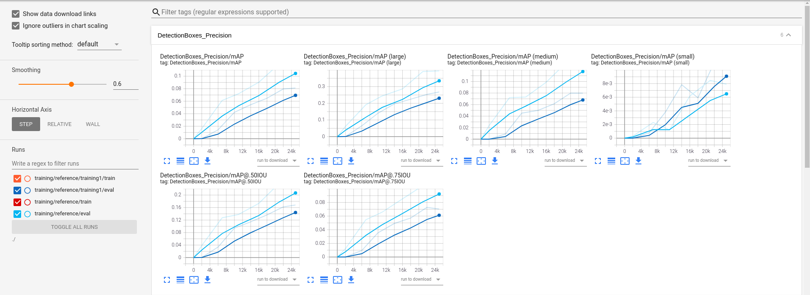
     
    <em>New Precision chart</em>

2. Recall chart:

    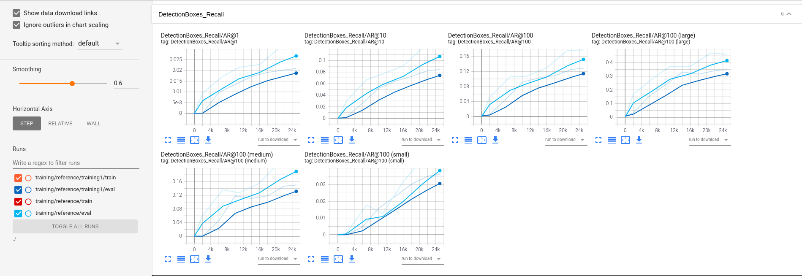
     
    <em>New Recall chart</em>

3. Loss chart:

    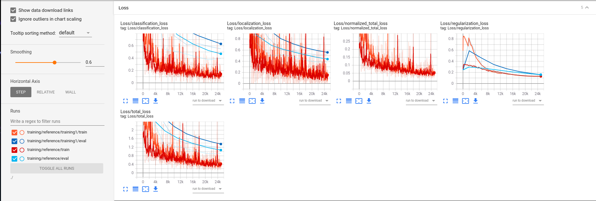
     
    <em>New Loss chart</em>

We can see in all three cases, our model performed much better than the first training and evaluation process. So, applying those augmentation changes definitely made the impact in our model.

Now, we have run the "explore_augmentation.ipynb" file. Here are the images,

    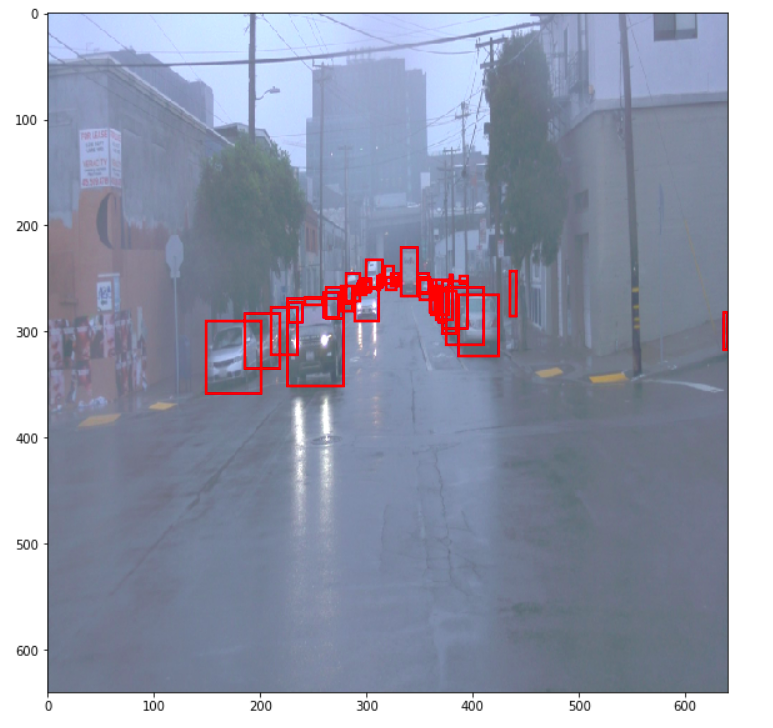
     
    <em>Images_1</em>

    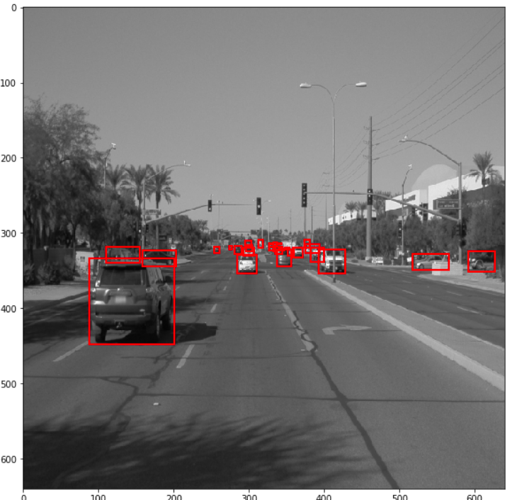
     
    <em>Images_2</em>

    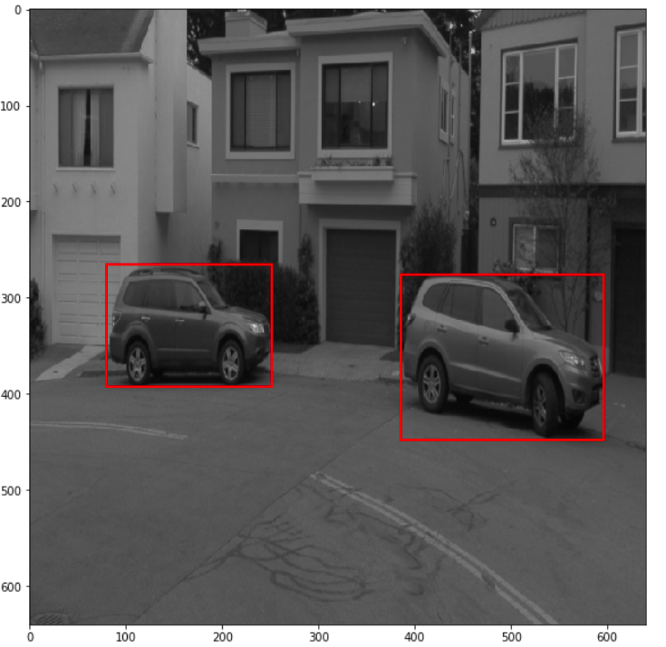
     
    <em>Images_3</em>

    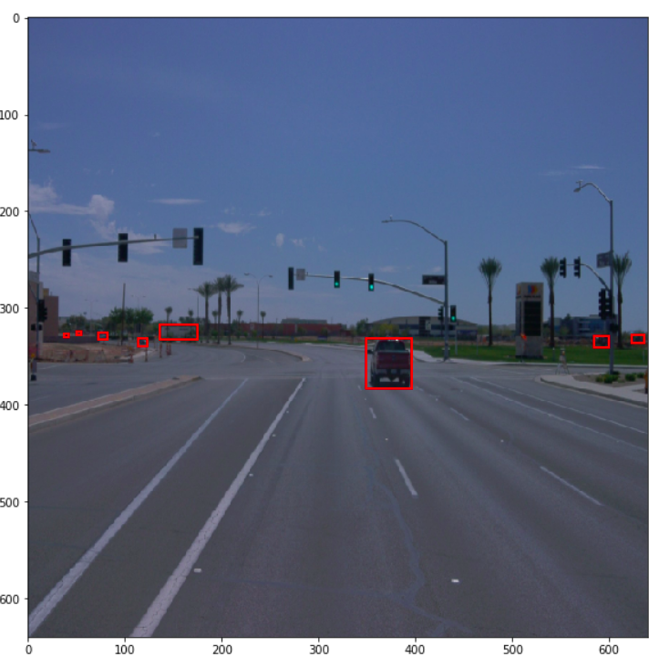
     
    <em>Images_4</em>

    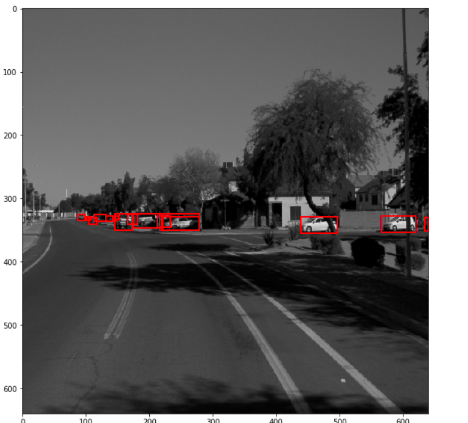
     
    <em>Images_5</em>

    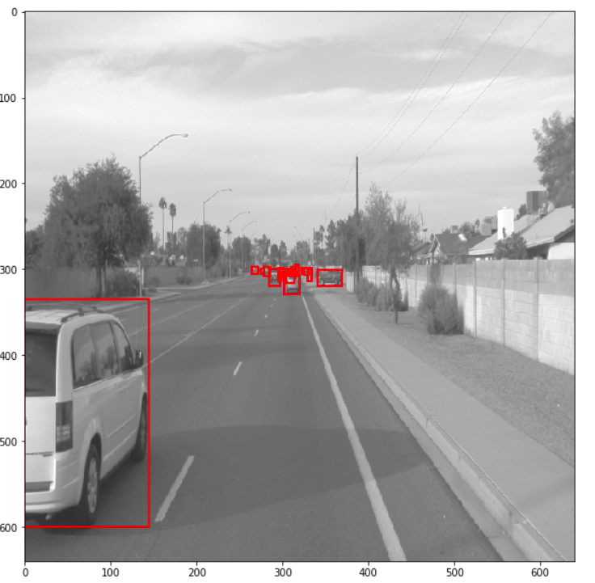
     
    <em>Images_6</em>

    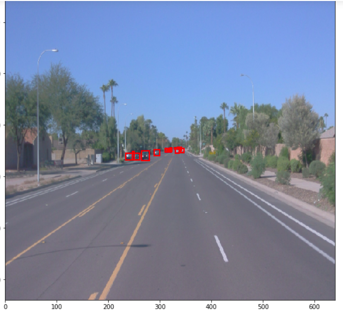
     
    <em>Images_7</em>

    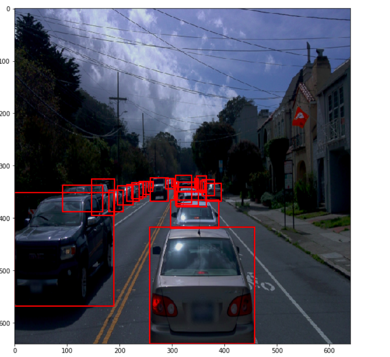
     
    <em>Images_8</em>

## Creating an animation

Modifying the arguments of the following function to adjust it to the model:

"python exporter_main_v2.py --input_type image_tensor --pipeline_config_path training/experiment0/pipeline.config --trained_checkpoint_dir training/experiment0 --output_directory training/experiment0/exported_model/"

Finally, created a video of our model's inferences for any tf record file. For that, we ran the following command:

"python inference_video.py -labelmap_path label_map.pbtxt --model_path training/experiment0/exported_model/saved_model --tf_record_path /home/workspace/data/test/tf.record --config_path training/experiment0/pipeline_new.config --output_path animation.mp4"

Here's our animation:

    

